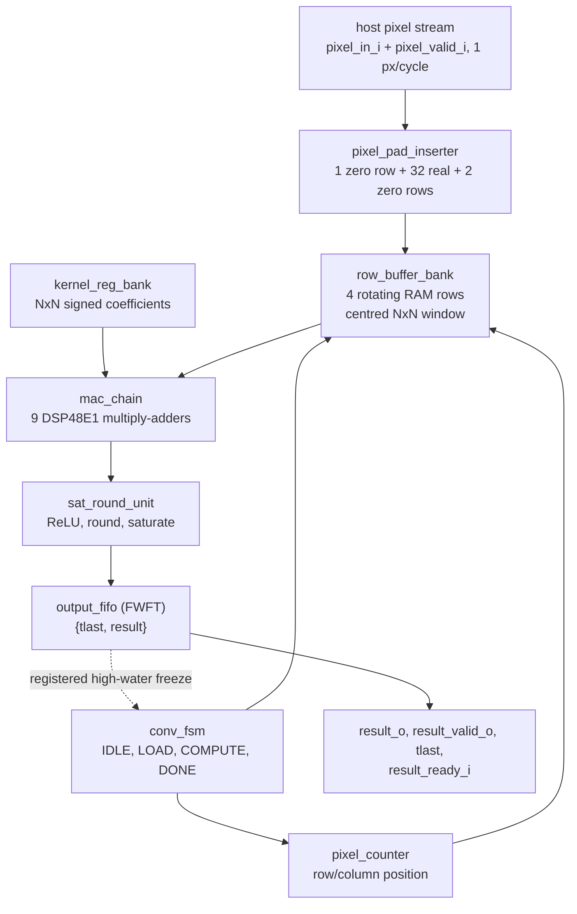

# CNN_Accelerator

## Repository layout

```
src/
├── top/
│   └── accelerator_top.v        # top level: datapath + control + memories
├── control/
│   ├── conv_fsm.v               # IDLE / LOAD / COMPUTE / DONE frame controller
│   └── pixel_counter.v          # input pixel position counter
├── datapath/
│   ├── pixel_pad_inserter.v     # synthesizes the vertically zero-padded raster
│   ├── row_buffer_bank.v        # centred NxN window from rotating RAM rows
│   ├── kernel_reg_bank.v        # programmable NxN coefficient registers
│   ├── mac_chain.v              # NxN DSP48E1 multiply-accumulate chain
│   ├── sat_round_unit.v         # optional ReLU, round-half-up, saturation
│   └── output_fifo.v            # FWFT output FIFO with registered back-pressure
└── tb/                          # one self-checking testbench per module
scripts/
├── run_ci.sh                    # iverilog CI: compiles and runs every tb_*.v
├── run_power_sim.tcl            # xsim run that dumps activity.saif for power
└── run_synth.tcl                # synthesis + place & route + reports
```

---

## Architecture



**Interfaces.** Input is a plain stream: `pixel_in_i` with `pixel_valid_i`, and
`ready_o` to back-pressure the host — stalls simply do not advance anything, and
the window, counters and pipeline stay in step. The kernel is loaded by the host
through `kernel_wr_valid_i` / `kernel_wr_data_i`, one coefficient per pulse, each
frame. Output is a first-word-fall-through FIFO with `result_valid_o`,
`result_tlast_o` and `result_ready_i`, sized to feed an AXI-Stream DMA.

**Frame sequence.** `start_i` → LOAD (N² host-paced coefficient writes) →
COMPUTE (the padded raster streams through the datapath, one output per accepted
pixel) → DONE. `result_tlast_o` marks the final output word of the frame.

---

## Simulation and implementation

**CI (Icarus Verilog).** Every module has a self-checking testbench with an
independent golden model, and CI compiles the whole RTL with each one:

```sh
./scripts/run_ci.sh
```

**Targeted simulation**, e.g. the end-to-end testbench:

```sh
iverilog -g2012 -o /tmp/tb_sim $(find src -name "*.v" -not -path "src/tb/*") \
    src/tb/tb_accelerator_top.v && vvp /tmp/tb_sim
```

**Synthesis, place & route and power** (Vivado 2025.2). Run the activity
simulation first so the power report can annotate switching activity:

```sh
vivado -mode batch -source scripts/run_power_sim.tcl   # -> synth_out/activity.saif
vivado -mode batch -source scripts/run_synth.tcl       # -> synth_out/*.rpt, .dcp
```

`accelerator_top` is the top module; constraints are in
`src/constraints/pynq_z2.xdc` (125 MHz on `clk_i`, pin H16).
